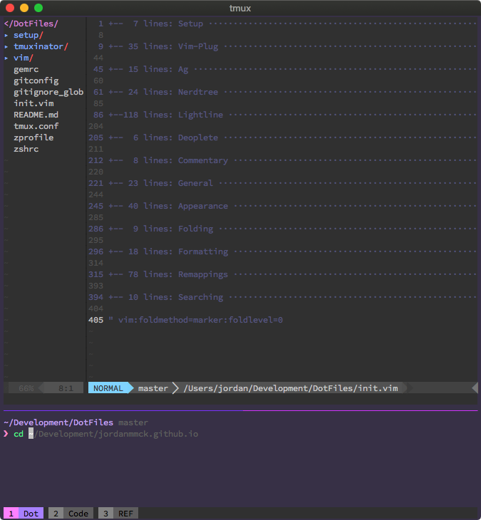

# dotfiles

My dotfiles for Vim, ZSH, Tmux, etc.

## ESLint, Prettier, AirBnB, VSCode

Using [this](https://github.com/paulolramos/eslint-prettier-airbnb-react/blob/master/eslint-prettier-config.sh) script based on [this](https://blog.echobind.com/integrating-prettier-eslint-airbnb-style-guide-in-vscode-47f07b5d7d6a) blog post.